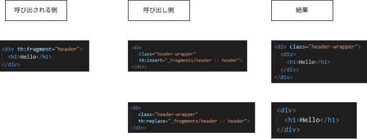
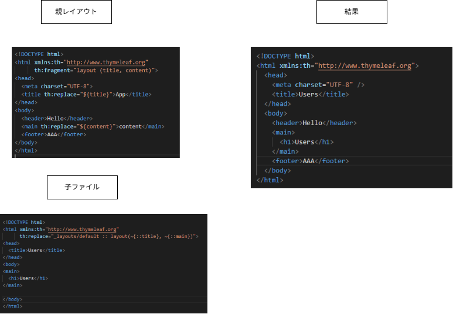

# Thymeleaf

## 共通化

| 種類        | 内容                                                           |
| :---------- | :------------------------------------------------------------- |
| th:fragment | フラグメントの定義（名前と引数を付けられる）                   |
| th:insert   | 指定フラグメントを要素の内側（子要素）に挿入。ホスト要素は残る |
| th:replace  | 指定フラグメントでホスト要素まるごと置き換え（ホストは消える） |

- 要素の置き換え、置換
- 
- タグの置き換え、置換
- 
