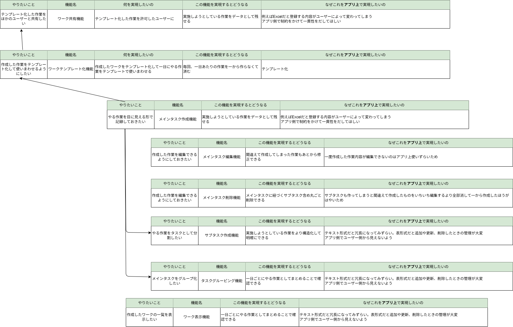
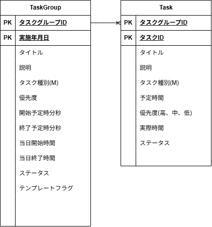

# 設計

<details>

<summary>1_機能一覧</summary>



- それを実現することでない場合と何が違うの(この機能ができたというゴールの明確化)
- なぜそれをアプリ上で実現したいの？(この機能は必要かどうか)
- 代替機能はないか(すべての機能を上げ切ってから)

</details>

<details>

<summary>2_画面遷移</summary>


</details>

<details>

<summary>3_論理データモデル</summary>



</details>

<details>

<summary>4_デザイン定義</summary>

- **リセット CSS**
  - ブラウザに付属しているデフォルトのスタイルを打ち消す（リセットする）CSS
  - CSS リセットとはブラウザによるスタイルの差異をなくすことが目的

[A Modern CSS Reset](https://www.joshwcomeau.com/css/custom-css-reset/)

**SMACSS**:SMACSS(Scalable and Modular Architecture for CSS)

| 役割   | 名前                                                                                                                   |
| :----- | :--------------------------------------------------------------------------------------------------------------------- |
| BASE   | プロジェクト全体で共通の基本的なスタイルの定義                                                                         |
| Layout | ページの主要なセクションやコンテナのレイアウトに関するスタイルを定義。ヘッダー、フッター、サイドバー、グリッドシステム |
| Module | 再利用可能な部品やコンポーネントに関するスタイルを定義                                                                 |
| State  | 特定の状態や状況に応じてスタイルを変更するためのスタイルを定義する                                                     |
| Theme  | プロジェクトのテーマやスキンに関するスタイルを定義する                                                                 |

- 基本方針

  - ブロック：独立した部品の塊 `block`
  - 要素：ブロックに従属する部分 `block__elem`
  - 修飾子：バリエーションや状態を表す追加クラス `--modifier`
  - 状態：JS や UI で切り替わる状態 `is-`,`has-`
  - レイヤー：設計上の層で名前空間 `l-`=Layout,`c-`=Component/Module

- 命名ルール

  - 名詞 → 形容詞の順で考える
  - `c-nav`（名詞） → `c-nav__link`（名詞） → `c-nav__link--active`（形容詞）。BEM の原則。

  - ブロック＝再利用単位、要素は外に漏らさない
  - 例：`.c-nav__list` は `.c-nav` の内部でのみ使用。

  - 修飾子は“追加クラス”で
  - `.c-nav__link c-nav__link--primary` のように上書き依存を避ける。

  - 状態は is-/has-
  - `.is-current`, `.has-dropdown` のように動的変化を即読可能に。

  - レイヤの接頭辞で用途を即判別
  - l-（レイアウト）/c-（コンポーネント）/u-（ユーティリティ）/js-（JS フック; スタイル非対象）など。BEMIT/ITCSS 流。

  - ユーティリティは短く・単機能
  - `u-hidden`, `u-sr-only`, `u-mx-auto` など。SUIT CSS もユーティリティを明確化。

  - 英小文字＋ハイフンを基本（BEM 規則）
  - `block-name__elem-name--mod-name` プロジェクト合意があればキャメルも可（SUIT）。

  - 見た目語は修飾子/テーマ側に追放
  - `--primary`, `--emphasis`, `theme-dark` など。“青いボタン”ではなく“主要ボタン”。

  - ブレイクポイントや状況は接尾辞/ユーティリティで
  - BEMIT では @mq の名前空間/接尾辞の考え方あり（例：u-hidden@md など、実装はプロジェクトで統一）

  - 一貫性＞正解
  - 方式は BEM/SMACSS/SUIT/CUBE いずれでも、チームでガイド化して守ることが最重要

</details>

<details>

<summary>5_アーキテクチャ</summary>

- フォルダ構成(サーバー側)

```

XXXX
├─ domain/
│  ├─ model/                  　//ドメイン情報をもつエンティティを定義
│  │     ├─ aggregate // ほかのドメインオブジェクトを集約したオブジェクト
│  │     ├─ transitions // 列挙型の集合操作
│  │     ├─ segment // 区分オブジェクト
│  │     ├─ value // 値オブジェクト
│  └─ port/
│       └─ XXXXGateway.java /adapter/db/XXXXAdapterのインターフェース　  集約リポジトリ
│
├─ application/
│  ├─ usecase/XXXXUseCase.java      // 入力ポート(インターフェース)
│  ├─ input/XXXXInput.java          // ユースケースに渡すインプット情報
│  ├─ output/XXXXOutput.java        // ユースケースから返すアウトプット情報
│  └─ service/XXXXService.java  // ユースケースの実装処理
└─ adapter/
      ├─web/
      │  ├─ XXXXController.java                // 画面からのリクエストを受け、レスポンスを返す
      │  ├─ form/XXXXForm.java          　     // 画面入力用フォームDTO
      │  └─ viewModel/XXXXViewModel.java       // 画面出力用DTO
      └─db/
         ├─XXXXMapperDto.java               // Mybatisから受け取ったデータをマッピングするDto
         └─XXXXMapper.java                  // MyBatis Mapperインターフェース
         └─XXXXMapperAdapter.java           // DBの操作や結果をドメインに渡して取得するメソッドを保持

```

- フォルダ構成(画面側)

```

src/main/resource
├─ template/                          ← Thymeleaf テンプレート
│     ├─ _layouts/
│     │     └─ default.html           ← レイアウト
│     ├─ _fragments/
│     │     ├─ header.html            ← ヘッダー
│     │     ├─ footer.html            ← フッター
│     │     └─ scripts.html           ← スクリプトタグ
│     ├─ XXXX/
│     │     └─ index.html
└─ static/                      ← 静的ファイル
   ├─ css/
   │  ├─ base/                  ← SMACSS: Base（リセット等）
   │  │  ├─ reset.css
   │  ├─ layout/                ← SMACSS: Layout（ページ骨格）
   │  │  ├─ header.css
   │  ├─ module/                ← SMACSS: Module（再利用部品）
   │  │  ├─ XXXX.css
   │  ├─ state/                 ← SMACSS: State（状態）
   │  │  ├─ state.css
   │  ├─ theme/                 ← SMACSS: Theme（配色等）
   │  │  └─ theme.css
   │  └─ main.css               ← 必要なら上記を @import もしくはビルドで結合
   └─ js/


```

</details>
